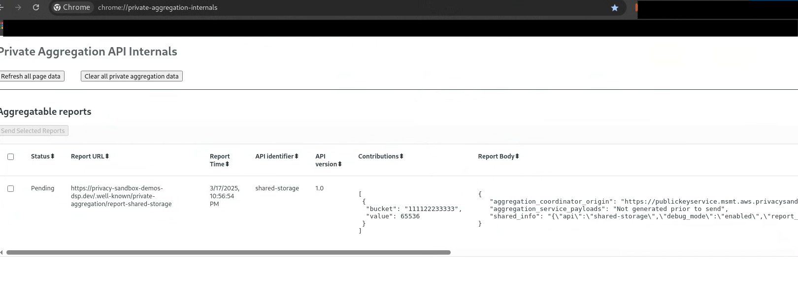
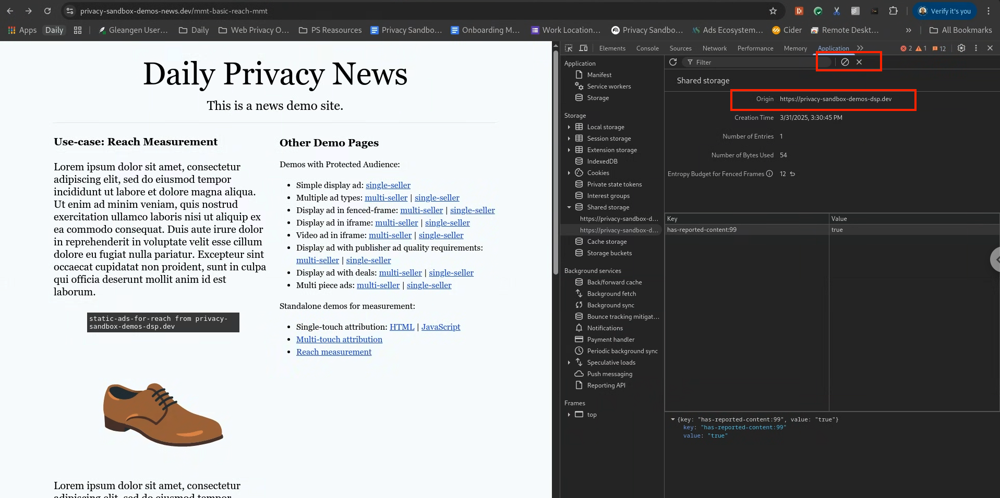

reach-measurement-with-shared-storage

import Tabs from '@theme/Tabs'; import TabItem from '@theme/TabItem';

# Reach Measurement

<Tabs>
<TabItem value="overview" label="Overview" default>

## Overview

### Background

The Private Aggregation API allows for the collection of aggregate data from [worklets](https://developer.mozilla.org/docs/Web/API/Worklet) that have
access to **_cross-site_** data. This API is particularly useful for developers who are building reporting functions within
[Shared Storage](https://developers.google.com/privacy-sandbox/private-advertising/shared-storage) and
[Private Aggregation](https://developers.google.com/privacy-sandbox/private-advertising/private-aggregation).

- **Aggregate data collection**: The Private Aggregation API focuses on collecting data in aggregate, which means that individual user data is not
  identifiable. This helps to protect user privacy while still allowing for valuable insights to be gleaned from the data.
- **Cross-site data access**: Worklets that have access to cross-site data can use the Private Aggregation API to collect data from multiple sites.
  This can be useful for tracking user behavior across different websites or for measuring the effectiveness of advertising campaigns.
- **Shared Storage and Private Aggregation**: The concepts that are demonstrated in the use of the Private Aggregation API are relevant for developers
  who are working with Shared Storage and Private Aggregation. These APIs are designed to protect user privacy while still allowing for data to be
  collected and used for advertising and other purposes.
- **Importance for developers**: By understanding how the Private Aggregation API works and how it can be used, developers can build more effective
  and privacy-conscious reporting functions within these APIs.

### Description

Many content producers and advertisers want to know how many unique people saw their content - **ad reach** . By using the Shared Storage and Private
Aggregation APIs, this demo is used to show that ad reach can be measured the **first** time an ad is viewed, without contributing to reach
measurement on subsequent views of the ad.

:::info

The approach demonstrated in this demo may be referred to as **point in time reach**. In this approach we will demonstrate one aggregate contribution
for the entire lifetime of the flag in Shared Storage (~30 days) whereas, another approach may measure reach over some defined number of trailing
days.

:::

### Privacy Sandbox APIs and related documentation

- [Private Aggregation :arrow_upper_right:](https://developers.google.com/privacy-sandbox/private-advertising/private-aggregation)
- [Private Aggregation API fundamentals :arrow_upper_right:](https://developers.google.com/privacy-sandbox/private-advertising/private-aggregation/fundamentals)
- [Shared Storage :arrow_upper_right:](https://developers.google.com/privacy-sandbox/private-advertising/shared-storage)
- [Unique reach measurement :arrow_upper_right:](https://developers.google.com/privacy-sandbox/private-advertising/private-aggregation/unique-reach)

### Related parties

- Advertiser
- DSP

</TabItem>
<TabItem value="Design" label="Design">

## Design

### Goals

In this demo, we assume an advertiser would like to measure the unique reach of marketing campaigns. By using a combination of Shared Storage and
Private Aggregation APIs, we will demonstrate an effective method for reach measurement available within Privacy Sandbox.

### Assumptions

This use case assumes the advertiser has contracted with a publisher or won a bid to display their ads on the publisher site (e.g. News site). This
use case does not cover ad-targeting specifics, so we assume the user would be presented with a relevant ad or campaign for which reach will be
measured.

### Key Exclusions

This use case pertains to Private Aggregation reports in their raw, unprocessed state, prior to aggregation or summarization. This use case does not
encompass demonstrations of the Aggregation Service, nor does it include demonstration of noise addition to summary reports or the implementation of
ad tech beyond what is outlined in the use case description and design.

### System Design

- The user visits the [news site](https://privacy-sandbox-demos-news.dev/mmt-basic-reach-mmt) where an ad is rendered.
- Inside this ad frame, the ad-tech loads a JavaScript module for reach measurement and creates a Shared Storage worklet to trigger reporting if
  necessary.
- The ad-tech maintains a flag in Shared Storage to note whether a report for reach measurement has been generated from this browser using the Shared
  Storage getter and setter methods.
- If a reach report has been sent previously, the ad-tech ends the Shared Storage worklet execution.
- If a reach report has not been sent previously, the ad-tech triggers reporting using the `privateAggregation.contributeToHistogram()` method and the
  corresponding aggregatable report is scheduled to be sent to the ad-tech’s `.well-known` endpoint
- The ad-tech updates the flag in Shared Storage to indicate that a report has been sent.

#### User Journey

```mermaid

sequenceDiagram
Title: Reach Measurement

participant Browser
participant Publisher
participant SSP
participant Advertiser
participant DSP

Browser-)SSP:User visits a publisher site
SSP-->>Browser: SSP runs auction and loads the winning ad into an iframe*

Note right of Browser:* We skip the auction flow<br/> to focus on measurement and Shared Storage

Browser->>DSP:Browser loads ad creative

Browser-->>Browser:Check for previously sent reach reports using sharedStorage.get(some_key) method.

Browser-->>Browser:If sharedStorage.get(some_key) fails to return result, create reach report.

Note right of Browser:* We skip the reach reporting flow<br/> if sharedStorage.get(some_key) returns a result.

Browser-)DSP: Trigger reporting using privateAggregation.contributeToHistogram()


Browser-)DSP: View aggregatable reports delivered to .well-known endpoint (https://privacy-sandbox-demos-dsp.dev/reporting/view-reports)


```

</TabItem>
<TabItem value="demo" label="Demo">

## Demo

### Prerequisites

- Latest stable version of Chrome (Open `chrome://version` to check your current version)
- Enable Privacy Sandbox APIs (Open `chrome://settings/adPrivacy` to enable _Ad measurement_)
- Clear your browsing history before you run one of the demo scenario below (Open `chrome://settings/clearBrowserData` to delete your browsing
  history)
- Open `chrome://private-aggregation-internals/` and click "Clear all private aggregation data"

### User Journey

1. [Navigate to news site](https://privacy-sandbox-demos-news.dev/mmt-basic-reach-mmt) (a publisher)
2. Open Chrome DevTools. View Application > Shared Storage - under origin `https://privacy-sandbox-demos-dsp.dev` verify that `has-reported-content`
   is set to true 
3. View local Private Aggregation API Internals (Chrome generated) reports by pasting the following into your Chrome address box:
   `chrome://private-aggregation-internals/` verify a report has been generated by Chrome.
   
4. Click select the report and click "Send Selected Report"
5. Verify the report has been sent to the well-known endpoint: `https://privacy-sandbox-demos-dsp.dev/reporting/view-reports`
   
6. Reload the [news site](https://privacy-sandbox-demos-news.dev/mmt-basic-reach-mmt)
7. In Chrome DevTools. View Application > Shared Storage - under origin `https://privacy-sandbox-demos-dsp.dev` verify that has-reported-content is
   set to true

   

8. Verify no additional reports are sent to the well-known endpoint by repeating stems 1-7.

9. Delete Shared Storage via Chrome DevTools > Application > Shared Storage 

10. Verify new reports are sent by repeating steps 1-7.

### Implementation details

#### Using Shared Storage to identify previously displayed ads.

:::info

_Key term_: A [worklet](https://developer.mozilla.org/docs/Web/API/Worklet) lets you run specific JavaScript functions and return information back to
the requester. There are different types of worklets, Shared Storage uses the
[SharedStorageWorklet](https://developer.mozilla.org/docs/Web/API/SharedStorageWorklet) . Within a SharedStorageWorklet, you can execute JavaScript
but you cannot interact or communicate with the outside page.

:::

The ad returned by the ad buyer will:

- Include JavaScript as a script tag named `static-ads-for-reach.js` to define and measure unique reach.
- Add a new Shared Storage module for reach measurement.
- Create a new worklet `reach-measurement-worklet.js` to invoke the module.

## Add the module for the Reach Measurement

The `static-ads-for-reach.js` file:

- Adds the reach measurement module using `sharedStorage.worklet.addModule()` (line 4).
- Invokes the reach measurement worklet using `sharedStorage.run()` (line 9).
- Attributes ( data ) to be measured. In the use case the attributes being measured are `contentId`, `geo`, and `createiveId` (lines 11 - 15).
- Passes additional data to be used as dimensions in reach measurement. In the use case the attributes being passed are contentId, geo, and creativeId
  (line 10).

**static-ads-for-reach.js**

```javascript showLineNumbers

(() => {
  const measureUniqueReach = async () => {
    // Load the Shared Storage worklet
    await window.sharedStorage.worklet.addModule(
      '/js/dsp/usecase/reach-measurement/reach-measurement-worklet.js',
    );

    // Run the reach measurement operation
    await window.sharedStorage.run('reach-measurement', {
      data: {
        contentId: 99,
        geo: 'san jose',
        creativeId: '55',
      },
    });
  };

  /** Main function */
  (() => {
    measureUniqueReach();
  })();
})();
```

## Implement the Reach Measurement Worklet

The **reach-measurement-worklet.js** file:

- Defines the `ReachMeasurementOperation` class
  - Identifies the previously reported measures via the hasReportedContent variable (line 13).
  - Sends aggregatable reports to the `.well-known` endpoint via the `privateAggregation.contributeToHistogram()` api (line 29).
  - Sets a flag in Shared Storage via `sharedStorage.set()` api (line 31) to indicate that the browser has previously generated aggregatable reports.
- Convert Content ID to an aggregation key via `convertContentIdToBucket()` function (line 24).
- Registers the `ReachMeasurementOperation` class to the `reach-measurement` Shared Storage operation (line 36).

```javascript showLineNumbers
...
const SCALE_FACTOR = 65536;
function convertContentIdToBucket(contentId) {
  return BigInt(contentId);
}

class ReachMeasurementOperation {
  async run(data) {
    const {contentId} = data;

    // Read from Shared Storage
    const ssKey = `has-reported-content:${contentId}`;
    const hasReportedContent = (await sharedStorage.get(ssKey)) === 'true';

    // Do not report if a report has been sent already
    if (hasReportedContent) {
      console.log('[PSDemo] Content ID already seen, not reporting', {
        key: ssKey,
      });
      return;
    }

    // Generate the aggregation key and the aggregatable value
    const bucket = convertContentIdToBucket(contentId);
    const value = 1 * SCALE_FACTOR;

    // Send an aggregatable report via the Private Aggregation API
    console.log('[PSDemo] Contributed to histogram', {bucket, value, ssKey});
    privateAggregation.contributeToHistogram({bucket, value});
    // Set the report submission status flag
    await sharedStorage.set(ssKey, true);
  }
}

// Register the operation
register('reach-measurement', ReachMeasurementOperation);
```

</TabItem>
</Tabs>
