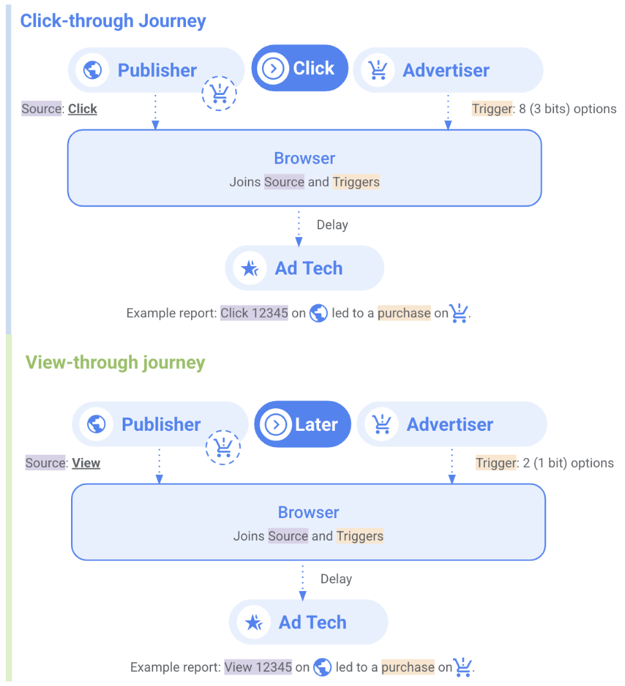

import Tabs from '@theme/Tabs'; import TabItem from '@theme/TabItem';

# Event-level reports for single touch attribution

<Tabs>
<TabItem value="overview" label="Overview" default>

## Overview

### Description

Event-level reports help measure ad effectiveness while protecting user privacy. This demo shows how the Attribution Reporting API links ad
interactions to conversions without revealing user identities across websites. It focuses on single-touch attribution using the last-click model.


### Privacy Sandbox APIs

- [Attribution Reporting API](https://developer.chrome.com/en/docs/privacy-sandbox/attribution-reporting/)
- [Get started with Attribution Reporting](https://developers.google.com/privacy-sandbox/private-advertising/attribution-reporting/getting-started)

### Related parties

- Publisher: Hosts ads
- Advertiser: Hosts conversion pages, tracks conversions
- Ad Tech: Implements API, receives cross-site reports

</TabItem>
<TabItem value="scope" label="Scope">

## Scope

### System Design

We are exploring two distinct user journeys for ad attribution:

- User Journey 1: Click-through conversion: The user visits a news site, clicks on an ad, then navigates to the advertiser's site where they convert.
  The system tracks the ad click and the subsequent conversion.
- User Journey 2: View-through conversion: The user sees an ad on a news site without clicking it. Later, they independently visit the advertiser's
  site and convert. The system connects this conversion to the earlier ad view. In both cases, the Attribution Reporting API links the ad interaction
  (click or view) to a conversion without compromising user privacy across sites.

### Attribution Reporting (Event-level) Flow

We focus on two user journeys: click-through and view-through conversions. In the click-through journey, the user actively clicks an ad on a
publisher's site before converting on the advertiser's site. In the view-through journey, on the other hand, the user sees an ad without clicking, and
later independently visits and converts on the advertiser's site. Both journeys enable advertisers to measure ad effectiveness by linking ad
interactions (clicks or views) to conversions, all while preserving user privacy across different websites.


The following sequence diagram illustrates these two main user journeys in digital advertising attribution: click-through and view-through. It shows
how the Attribution Reporting API tracks user interactions across publisher and advertiser websites, highlighting the key differences in timing and
user behavior between the two scenarios.

```mermaid
sequenceDiagram
participant User/Browser
participant Publisher Website
participant Advertiser Website
participant AdTech

rect rgb(200, 220, 240)
Note right of User/Browser: Click-through Journey
User/Browser->>Publisher Website: Visit website
Publisher Website->>AdTech: Register source (ad impression)
AdTech->>User/Browser: Set Attribution-Reporting-Register-Source header
Publisher Website->>Advertiser Website: Click ad
Advertiser Website->>AdTech: Register trigger
AdTech->>User/Browser: Set Attribution-Reporting-Register-Trigger header
User/Browser->>User/Browser: Generate report
User/Browser->>AdTech: Send report to /.well-known/attribution-reporting/report-event-attribution
end

rect rgb(220, 240, 200)
Note right of User/Browser: View-through Journey
User/Browser->>Publisher Website: Visit website
Publisher Website->>AdTech: Register source (ad impression)
AdTech->>User/Browser: Set Attribution-Reporting-Register-Source header
User/Browser->>User/Browser: Time passes
User/Browser->>Advertiser Website: Directly visit advertiser website & convert
Advertiser Website->>AdTech: Register trigger
AdTech->>User/Browser: Set Attribution-Reporting-Register-Trigger header
User/Browser->>User/Browser: Generate report
User/Browser->>AdTech: Send report to /.well-known/attribution-reporting/report-event-attribution
end
```

</TabItem>
<TabItem value="demo" label="Demo">

## Demo

### Prerequisites

- Chrome > v127 (Open chrome://version to look up your current version)
- Open chrome://attribution-internals/ and Click on “Clear all attribution data”

### Click-Through Conversion Journey

1. Clear attribution data in chrome://attribution-internals/
2. [Navigate to news site](https://privacy-sandbox-demos-news.dev/iframe-static-img-ad)

- ice skate shoes image will be displayed

3. Click on the ad image

- Demo shop site of skate shoes detail page will open

4. Check “SourceTrigger Registration” tab in chrome://attribution-internals
5. Go back to the shop site and click the "ADD TO CART" button
7. Review “Trigger Registration” and "Event-Level Reports" tab in chrome://attribution-internals

### View-Through Conversion Journey

1. Clear attribution data in chrome://attribution-internals/
2. [Navigate to news site](https://privacy-sandbox-demos-news.dev/iframe-static-img-ad)

- ice skate shoes image will be displayed

3. Click on "To the shop without ad click" below the image

- Demo shop site will open

4. Check “SourceTrigger Registration” tab in chrome://attribution-internals
5. Go back to the shop site and click an item
6. Click on the "ADD TO CART" button
7. Review “Trigger Registration” and "Event-Level Reports" tab in chrome://attribution-internals


### Implementation details

#### Register a source

Sources are registered when a user views or clicks an ad. This is done on the publisher's website.

To do so we need to:

- Initiate the source registration with an HTML element or a Javascript call
- Complete the source registration, responding to the request with the header Attribution-Reporting-Register-Source.
  

### Initiatie the source registration

For views:

```html


```
*Here's the [source code](https://github.com/privacysandbox/privacy-sandbox-demos/commit/cb581cb305b17d7442d0cd71eccfe851525a0cb7#diff-5bb02bedd9ceea45a3874a59caa25f4b9f80da3c3fe2098a88a55ea52a14dd52R4)

For clicks:

```js
function adClick() {
  const encoded = encodeURIComponent("https://privacy-sandbox-demos-dsp.dev/attribution/register-source?advertiser=privacy-sandbox-demos-shop.dev&amp;id=u26f8");
  const url = "https://privacy-sandbox-demos-shop.dev/items/26f8";
  window.open(
    url,
    "_blank",
    `attributionsrc=${encoded}`);
}
```
*Here's the [source code](https://github.com/privacysandbox/privacy-sandbox-demos/commit/cb581cb305b17d7442d0cd71eccfe851525a0cb7#diff-27409a7640486ec4d969bbd02bd8c6e523e5ee586ac666d913a19dfe2c77837dR20)

### Complete the source registration

For both clicks and views is to respond with the Attribution-Reporting-Register-Source header.

```js
res.set(
  "Attribution-Reporting-Register-Source",
  JSON.stringify({
    destination: "https://privacy-sandbox-demos-shop.dev";
    source_event_id: "1234",
    expiry: "604800",
    priority: "100",
    debug_key: "1234",
    debug_reporting: true,
  })
);
```
*Here's the [source code](https://github.com/privacysandbox/privacy-sandbox-demos/commit/cb581cb305b17d7442d0cd71eccfe851525a0cb7#diff-3e3c5e844647864b521c39ce06564f42b29325aa273ed61f4362ec498a39d6bdR99)

### Register a trigger

Triggers are registered when a user converts on the advertiser's website. Here we will use a pixel.


### Initiate the trigger registration

```html
<button onclick="addToCart()" type="submit"...>ADD TO CART</button>
```
```js
function addToCart() {
  const attributionReporting = {
    eventSourceEligible: false,
    triggerEligible: true,
  };
  const url = "https://privacy-sandbox-demos-dsp.dev/attribution/register-event-level-trigger?conversion-type=add-to-cart"
  window.fetch(url, {
    mode: "no-cors",  keepalive: true, attributionReporting
  });
}
```
*Here's the [source code](https://github.com/privacysandbox/privacy-sandbox-demos/commit/cb581cb305b17d7442d0cd71eccfe851525a0cb7#diff-fb8d83fec20a0b18888cbc05872559dbe6e79941c7e87ac2be6b251359801f3aR76)

### Respond with a header

Here, we set Attribution-Reporting-Register-Trigger on the request:

```js
res.set(
  "Attribution-Reporting-Register-Trigger",
JSON.stringify({
  event_trigger_data: [{
    trigger_data: "6",
    priority: "80",
  }],
  debug_reporting: true,
  debug_key: "1115698977"
});
);
```
*Here's the [source code](https://github.com/privacysandbox/privacy-sandbox-demos/commit/cb581cb305b17d7442d0cd71eccfe851525a0cb7#diff-49482cc7257904ce6c46dbb276a02120f18bc5b9f659ebaf92f112b59de0e07fR89)

### Set up an endpoint

All we have to do now is to create an endpoint at `https://adtech.example/.well-known/attribution-reporting/report-event-attribution` to receive
reports.


### Related API documentation

- [Attribution Reporting - Chrome Developers](https://developer.chrome.com/docs/privacy-sandbox/attribution-reporting/)
- [Attribution Reporting - Developer Guide](https://developer.chrome.com/docs/privacy-sandbox/attribution-reporting/developer-guide/)
- [Set up debug reports - Chrome Developers](https://developer.chrome.com/docs/privacy-sandbox/attribution-reporting-debugging/part-2/)

</TabItem>
</Tabs>
